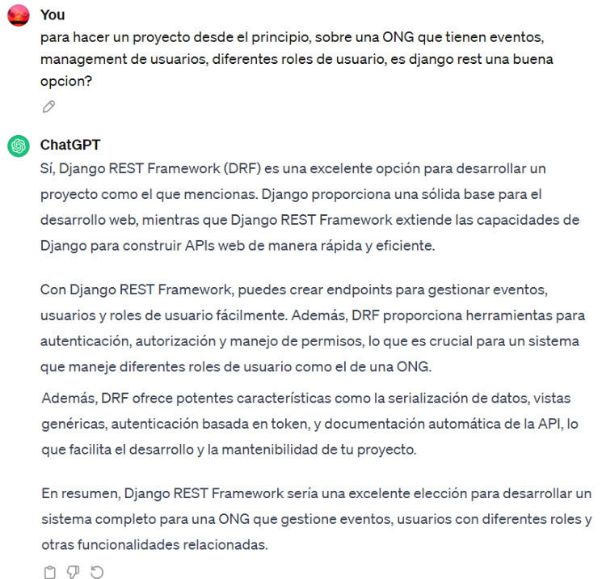
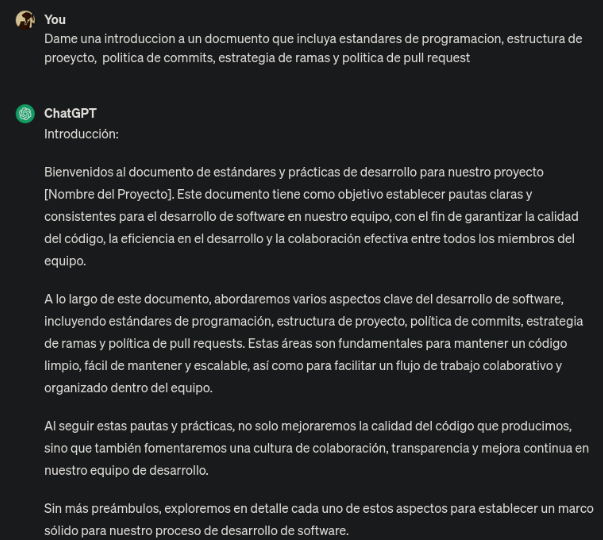
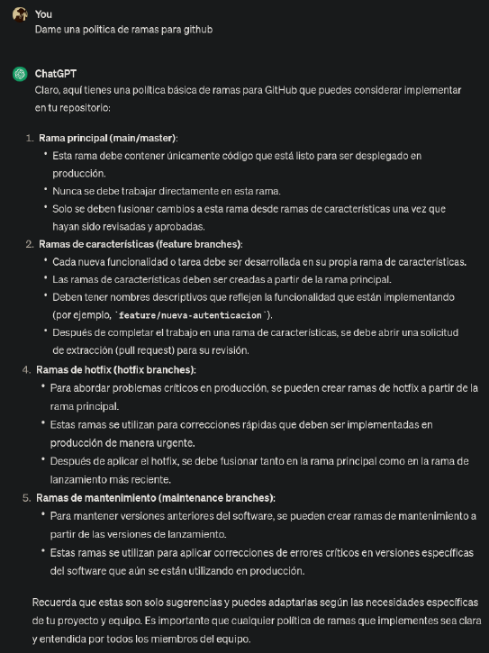
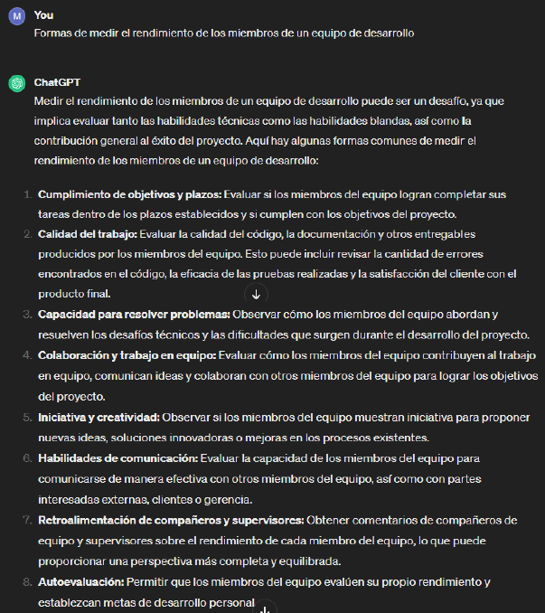
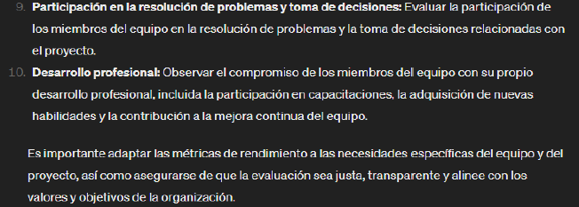

# &nbsp;&nbsp;&nbsp;&nbsp;&nbsp;&nbsp;&nbsp;&nbsp;&nbsp;&nbsp;&nbsp; Uso de Inteligencias Artificiales - Devising a Project

**_MIEMBROS_**:

|                                       |                                       |                                       |
|---------------------------------------|---------------------------------------|---------------------------------------|
| AURORA NAVAS JIMÉNEZ                  | MARÍA NÚÑEZ REYES                     | CLAUDIA GILABERT PRIETO               |
| MARTA INÉS GONZÁLEZ DIÁNEZ            | FÉLIX ÁNGEL GUDIEL GÜEMES             | MIGUEL ANGEL ROMALDE DORADO          |
| FRANCISCO DE ASÍS ROSSO RAMÍREZ       | PABLO PERIÁÑEZ CABRERO                | FRANCISCO JAVIER CALDERÓN RODRÍGUEZ  |
| PEDRO LOPEZ RUZ                       | IVÁN RAMÍREZ LARA                     | SAMUEL LUIS RODRÍGUEZ MANESS         |
| MANUEL ORTIZ BLANCO                   | SERGIO AGUAYO OROZCO                  | JUAN LUIS RUANO MURIEDAS             |
| MANUEL FRANCISCO BARCIA JIMENEZ       |

## Índice

1. Introducción
2. Objetivos
3. Peligros
4. Herramientas usadas
5. Gestión de Prompts
6. Conclusión

## Registro de cambios

<table>
  <tr>
   <td><strong>Versión</strong>
   </td>
   <td><strong>Fecha</strong>
   </td>
   <td><strong>Descripción</strong>
   </td>
  </tr>
  <tr>
   <td><strong>1.0.0</strong>
   </td>
   <td><strong>2/2/2024</strong>
   </td>
   <td><strong>Primera versión</strong>
   </td>
  </tr>
  <tr>
   <td><strong>2.0.0</strong>
   </td>
   <td><strong>15/2/2024</strong>
   </td>
   <td><strong>Añadido el registro de usos</strong>
   </td>
  </tr>
</table>

 

# 

 

# 1. Introducción

Este documento indica los usos que se le ha dado a las inteligencias artificiales para la redacción de los múltiples escritos que han sido completados durante la primera semana del proyecto. A parte de presentar las múltiples indicaciones que los modelos de aprendizaje de lenguaje nos han brindado, también se resalta la importancia de usar dichos sistemas y cómo pueden mejorar la redacción de documentos de ámbito profesional.

Es también importante marcar que las inteligencias artificiales nunca podrán sustituir a un humano. Por muy avanzada que sea esta tecnología, debe ser usada como apoyo al escritor, y no como un sustituto. 

# 2.  Objetivos

La principal finalidad del uso de sistemas inteligentes es obtener plantillas básicas para cada documento. Aunque una parte de los entregables se han estudiado en otras asignaturas del curso o directamente se han redactado informes de la misma naturaleza, la gran mayoría han hecho su primera aparición en este proyecto o son exclusivos de este trabajo. Por ello, para evitar generar documentos que tengan una estructura muy distinta a la esperada por parte de un externo, las inteligencias artificiales pueden proporcionar esqueletos básicos para cada tipo de crónica. Incluso si se conocen las pautas a seguir para redactar estos, es conveniente contrastar la información sabida con estos sistemas que pueden recolectar información variada y posiblemente sugerir al escritor apartados o temas relevantes. 

En los documentos más relacionados con cuestiones a evaluar, también se puede usar los modelos de aprendizaje. Ya que estas preguntas deben estar basadas en dudas comunes y razonables, la forma tradicional de descubrirlas es el diálogo con varios individuos relacionados con la temática. Estos modelos pueden tomar varias dudas frecuentes que se hallen en su base de datos y mostrarlas al escritor. De esta forma el autor puede no sólo encontrar preguntas que no se había planteado, si no también obtener una perspectiva distinta.

Aunque no sea recomendable basar todo el contenido de un informe en la salida de una inteligencia artificial, sí es cierto que pueden ser una guía inicial en un problema, sugiriendo posibles puntos de inicio en una temática o refiriéndose a una página u escrito que tenga información más detallada o recursos interesantes.

Ocasionalmente también pueden mejorar la calidad de la redacción, al ofrecer sinónimos para ciertas palabras, formas alternativas de mostrar una misma información o más simplemente buscando errores ortográficos o semánticos. 

En general, el uso promedio de los sistemas de información debe estar orientado a un apoyo o soporte básico, bien desde un punto de vista más general (estructura o información a estudiar, por ejemplo) o en un ámbito más concreto (recomendaciones a la hora de redactar, posiblemente).

# 3. Peligros.

Aunque es indiscutible que las inteligencias artificiales pueden ayudar en el desarrollo de un documento, no cabe lugar a duda que estos sistemas no son fiables. Al no tener capacidad propia de entendimiento o comprensión de su salida, siempre es posible que la información proporcionada no sea correcta o coherente.

Una base de datos pequeña, con un bias o incorrecta pueden generar respuestas que aunque estén bien formadas y parezcan razonables causen que un documento esté incompleto, incomprensible o directamente mal redactado. Aunque estas salidas son relativamente fáciles de detectar, siempre existe la posibilidad de que la respuesta de un modelo esté bien presentada pero basada en información errónea, que, suponiendo que el usuario ha preguntado al sistema porque no es experto en la materia, es más difícil de detectar.

Es por eso que el uso de estas tecnologías debe hacerse cautelosamente, no dando nada por sentado y contrastando la información obtenida con expertos en el tema o con conocimiento previamente verificado.

# 4. Herramientas usadas.

Hoy en día hay un gran repertorio de modelos de aprendizaje de lenguaje, todos con sus ventajas e inconvenientes. En este proyecto, se ha usado Chat GPT 3.5 mayormente, ya que múltiples miembros del equipo han tenido experiencias positivas con este sistema.

# 5. Gestión de Prompts.

A la hora de utilizar las distintas herramientas de inteligencia artificial, se ha registrado los distintos prompts utilizados por el equipo a modo de tener un control de los mismo y en su medida poder utilizarse a futuro.

A continuación se adjunta los prompts obtenidos junto a la respuesta de la IA:

	

- **Consulta sobre sistemas de backend**

 

 

- **Consulta sobre la estructura del documento de aspecto metodológico de desarrollo**

 

 

- **Consulta sobre política de ramas de Github**

 

 

- **Consulta sobre medidas de rendimiento**

 

 

- **Consulta sobre la estructura de este documento**

 

 

# 6. Conclusión.

El empleo de inteligencias artificiales ha facilitado y mejorado la redacción de todos los documentos generados en la primera semana del proyecto. Esto puede haber sido mediante optimización de creación de documentos o ayudas más esporádicas y pequeñas en aspectos de contenido y ortografía. Esto ha sido, obviamente, usando los sistemas como complementos que nunca deben sustituir el juicio humano. Toda la información obtenida de los modelos ha sido contrastada y validada antes de su uso. La inteligencia artificial puede ser una herramienta muy útil en varios ámbitos, no sólo en la redacción de documentos oficiales, pero como toda herramienta, debe saberse cómo usarla adecuadamente y no abusar de ella.

