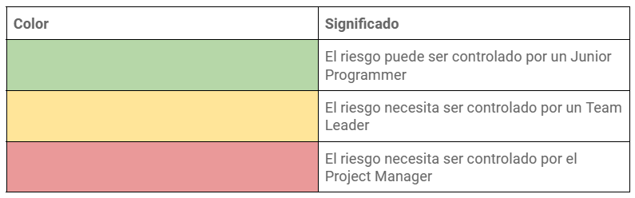
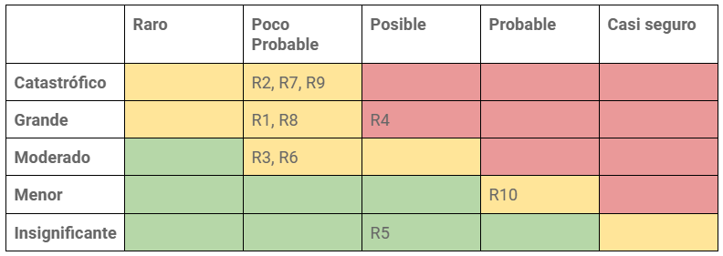

# &nbsp;&nbsp;&nbsp;&nbsp;&nbsp;&nbsp;&nbsp;&nbsp;&nbsp;&nbsp;&nbsp;&nbsp;&nbsp;&nbsp;&nbsp;&nbsp;&nbsp; Análisis de Riesgos - Devising a Project

***MIEMBROS***:

<table>
  <tr>
    <td>AURORA NAVAS JIMÉNEZ</td>
    <td>MARÍA NÚÑEZ REYES</td>
    <td>CLAUDIA GILABERT PRIETO</td>
  </tr>
  <tr>
    <td>MARTA INÉS GONZÁLEZ DIÁNEZ</td>
    <td>FÉLIX ÁNGEL GUDIEL GÜEMES</td>
    <td>MIGUEL ANGEL ROMALDE DORADO</td>
  </tr>
  <tr>
    <td>FRANCISCO DE ASÍS ROSSO RAMÍREZ</td>
    <td>PABLO PERIÁÑEZ CABRERO</td>
    <td>FRANCISCO JAVIER CALDERÓN RODRÍGUEZ</td>
  </tr>
  <tr>
    <td>PEDRO LOPEZ RUZ</td>
    <td>IVÁN RAMÍREZ LARA</td>
    <td>SAMUEL LUIS RODRÍGUEZ MANESS</td>
  </tr>
  <tr>
    <td>MANUEL ORTIZ BLANCO</td>
    <td>SERGIO AGUAYO OROZCO</td>
    <td>JUAN LUIS RUANO MURIEDAS</td>
  </tr>
  <tr>
    <td>MANUEL FRANCISCO BARCIA JIMENEZ</td>
    <td></td>
    <td></td>
  </tr>
</table>

## Índice

1. Propósito del análisis de riesgos
2. Roles y responsabilidades
3. Fondos para la gestión de riesgos
4. Tolerancia a riesgos de los interesados
5. Análisis de riesgos
   1. Métrica
   2. Registro de riesgos
   3. Análisis y priorización de riesgos
6. Matriz de evaluación de riesgos

## Registro de cambios

<table>
  <tr>
   <td><strong>Versión</strong></td>
   <td><strong>Fecha</strong></td>
   <td><strong>Descripción</strong></td>
  </tr>
  <tr>
   <td>1.0.0</td>
   <td>8/2/2024</td>
   <td>Primera versión</td>
  </tr>
  <tr>
   <td>1.0.1</td>
   <td>11/2/2024</td>
   <td>Actualizado después de la revisión</td>
  </tr>
  <tr>
   <td>2.0.1</td>
   <td>13/02/2024</td>
   <td>Actualizado después del feedback de la semana 3. Aclaración en la reserva de contingencias y en la descripción de los riesgos.</td>
  </tr>
  <tr>
   <td>2.0.2</td>
   <td>15/02/2024</td>
   <td>Actualizado después de revisión. Adición de la matriz de evaluación.</td>
  </tr>
  <tr>
   <td>2.0.3</td>
   <td>16/02/2024</td>
   <td>Adición del riesgo R9.</td>
  </tr>
</table>

 

# 

 

# 1. Propósito del análisis de riesgos

Nuestro objetivo es garantizar que los riesgos de nuestro proyecto sean identificados, analizados y mitigados con éxito, para que posteriormente no suframos percances inesperados que perjudiquen al desarrollo del proyecto.

Empezaremos con un proceso de planificación con el máximo de detalles posible, en el que comenzaremos analizando cómo gestionaremos los riesgos del proyecto, así como la identificación de los riesgos que existan. Una vez los tengamos, planificaremos posibles soluciones para los riesgos y a lo largo del tiempo se ejecutará un seguimiento para poder monitorizarlos.

 

# 2. Roles y responsabilidades

En la siguiente tabla se exponen los roles de nuestro proyecto y las responsabilidades que tienen en el ámbito de la gestión de riesgos.

Nuestra organización dispone de más roles, sin embargo, éstos no disponen de responsabilidades especiales con respecto a gestión de riesgos más allá de aquellas expuestos en esta tabla.

<table>
  <tr>
   <td><strong>Rol</strong>
   </td>
   <td><strong>Responsabilidad</strong>
   </td>
  </tr>
  <tr>
   <td>Project Manager
   </td>
   <td>Identificar los riesgos y desarrollar planes de contingencias para ellos. Además de supervisar el desarrollo del proyecto para identificar nuevos riesgos y que los planes de contingencia funcionen como lo contemplado.
   </td>
  </tr>
  <tr>
   <td>Team Leader
   </td>
   <td>Identificar los riesgos de sus respectivos equipos, reportarlos al project manager y asegurarse de que los junior programmers sigan los planes de contingencias.
   </td>
  </tr>
  <tr>
   <td>Junior Programmer
   </td>
   <td>Revisar el registro de riesgos, reportarlos a sus respectivos team leaders, y seguir los planes de contingencia para evitar y/o subsanar riesgos durante el proyecto.
   </td>
  </tr>
</table>

 

# 3. Fondos para la gestión de riesgos

Del presupuesto total del proyecto se ha establecido un 10% del coste total de desarrollo para la contingencia de riesgos, específicamente, 5.212,95€. La cantidad determinada se encuentra definida en el documento de **Análisis de costes**, así como el presupuesto total.

 

# 4. Tolerancia a riesgos de los interesados

En la siguiente tabla se exponen la tolerancia a riesgos que presentan cada uno de los interesados en el proyecto.

<table>
  <tr>
   <td><strong>Interesado</strong>
   </td>
   <td><strong>Nivel de tolerancia</strong>
   </td>
   <td><strong>Descripción</strong>
   </td>
  </tr>
  <tr>
   <td>Cliente
   </td>
   <td>Bajo
   </td>
   <td>El cliente quiere un producto final funcional completo.
   </td>
  </tr>
  <tr>
   <td>Project Manager
   </td>
   <td>Medio
   </td>
   <td>Su objetivo principal es contar con un producto acabado y funcional, manteniendo la cohesión del equipo.
   </td>
  </tr>
  <tr>
   <td>Team Leader
   </td>
   <td>Medio
   </td>
   <td>Espera que se mantenga la productividad del equipo y se cumplan los plazos establecidos.
   </td>
  </tr>
  <tr>
   <td>Junior Programmer
   </td>
   <td>Medio
   </td>
   <td>Necesita instrucciones claras y un entorno de trabajo estable para realizar sus tareas.
   </td>
  </tr>
</table>

 

# 5. Análisis de riesgos

## Métrica

En esta tabla se expone la métrica usada para el análisis de riesgos.

<table>
  <tr>
   <td><strong>Métrica</strong>
   </td>
   <td><strong>Magnitud</strong>
   </td>
  </tr>
  <tr>
   <td>Tipo
   </td>
   <td>Estimación, técnico, requisitos, organizativo, interno, externo, interno-externo
   </td>
  </tr>
  <tr>
   <td>Probabilidad
   </td>
   <td>1 (raro que ocurra), 2 (poco probable), 3 (posible), 4 (probable), 5 (casi seguro)
   </td>
  </tr>
  <tr>
   <td>Impacto
   </td>
   <td>1 (insignificante), 2 (menor), 3 (moderado), 4 (grande), 5 (catastrófico)
   </td>
  </tr>
  <tr>
   <td>Factor
   </td>
   <td>Producto entre la probabilidad y el impacto
   </td>
  </tr>
  <tr>
   <td>Prioridad
   </td>
   <td>Número del 1 al 10. Siendo 1 la máxima prioridad que se le puede dar a la mitigación y monitorización de un riesgo,  y 10 la mínima
   </td>
  </tr>
</table>

 

## Registro de riesgos

En la siguiente tabla, se presentan todos los riesgos identificados en el proyecto.

<table>
  <tr>
   <td><strong>Id</strong>
   </td>
   <td><strong>Riesgo</strong>
   </td>
  </tr>
  <tr>
   <td>R1
   </td>
   <td>Lenta respuesta por parte de los clientes. Nuestro proyecto depende en gran parte del feedback de Manos Abiertas con Norte, y por tanto, la nula respuesta interferiría directamente en el proyecto.
   </td>
  </tr>
  <tr>
   <td>R2
   </td>
   <td>Cambios en los deseos del cliente. 
   </td>
  </tr>
  <tr>
   <td>R3
   </td>
   <td>Incapacidad de realizar un requisito por falta de conocimientos. Todos los desarrolladores tienen experiencia con las herramientas usadas, sin embargo, se podría dar el caso en el que un desarrollador se quede bloqueado con un requisito dado el grado de dificultad de éste.
   </td>
  </tr>
  <tr>
   <td>R4
   </td>
   <td>Baja de un integrante del equipo. Incapacidad de un miembro del equipo dado un imprevisto, como por ejemplo, una enfermedad.
   </td>
  </tr>
  <tr>
   <td>R5
   </td>
   <td>Exceder el presupuesto. Podría darse el caso en el que los miembros del equipo echan más horas de lo establecido, y como resultado, se exceda el presupuesto.
   </td>
  </tr>
  <tr>
   <td>R6
   </td>
   <td>Fallo en el hardware de algún miembro. 
   </td>
  </tr>
  <tr>
   <td>R7
   </td>
   <td>Baja productividad por parte del equipo. Puede darse el caso en el que el equipo no esté lo suficientemente motivado y no se produzca tanto resultado como se contemplaba.
   </td>
  </tr>
  <tr>
   <td>R8
   </td>
   <td>Retraso en los hitos establecidos. Para cada sprint hay una serie de requisitos que tienen que estar satisfechos. Puede darse el caso en el que no se tengan completados para la fecha límite.
   </td>
  </tr>
  <tr>
   <td>R9
   </td>
   <td>Malentendido entre el equipo del proyecto y el cliente. Puede darse el caso en el que el equipo no entienda bien los requisitos del cliente y los incrementos del producto no se acerquen a lo que Manos Abiertas tenía en mente.
   </td>
  </tr>
  <tr>
   <td>R10
   </td>
   <td>Estimación temporal de las tareas demasiado optimista 
   </td>
  </tr>
</table>

 

## Análisis y priorización de riesgos

<table>
  <tr>
   <td><strong>Id</strong>
   </td>
   <td><strong>Tipo</strong>
   </td>
   <td><strong>Probabilidad</strong>
   </td>
   <td><strong>Impacto</strong>
   </td>
   <td><strong>Factor</strong>
   </td>
   <td><strong>Prioridad</strong>
   </td>
   <td><strong>Respuesta</strong>
   </td>
  </tr>
  <tr>
   <td>R1
   </td>
   <td>Externo
   </td>
   <td>2
   </td>
   <td>4
   </td>
   <td>8
   </td>
   <td>2
   </td>
   <td>Se sacará el mayor provecho posible de las reuniones y contacto que haya. 
   </td>
  </tr>
  <tr>
   <td>R2
   </td>
   <td>Externo y requisitos
   </td>
   <td>2
   </td>
   <td>5
   </td>
   <td>10
   </td>
   <td>1
   </td>
   <td>En cada sprint, Manos Abiertas llevará a cabo su rol como usuario piloto y rellenarán un formulario para darnos feedback y cambiar a tiempo lo que sea posible.
   </td>
  </tr>
  <tr>
   <td>R3
   </td>
   <td>Técnico y organizativo
   </td>
   <td>2
   </td>
   <td>3
   </td>
   <td>6
   </td>
   <td>4
   </td>
   <td>Pedir ayuda al grupo de trabajo lo antes posible.
   </td>
  </tr>
  <tr>
   <td>R4
   </td>
   <td>Interno
   </td>
   <td>3
   </td>
   <td>4
   </td>
   <td>12
   </td>
   <td>6
   </td>
   <td>Redistribución de tareas asignadas de esa persona y consideración de reducción del alcance si es necesario.
   </td>
  </tr>
  <tr>
   <td>R5
   </td>
   <td>Estimación
   </td>
   <td>3
   </td>
   <td>1
   </td>
   <td>3
   </td>
   <td>7
   </td>
   <td>Mitigar priorizando algunas actividades esenciales. Por nuestras condiciones, no tendría un gran impacto en el proyecto.
   </td>
  </tr>
  <tr>
   <td>R6
   </td>
   <td>Técnico y organizativo
   </td>
   <td>2
   </td>
   <td>3
   </td>
   <td>6
   </td>
   <td>8
   </td>
   <td>Se usará un repositorio de código y se harán commits regularmente.
   </td>
  </tr>
  <tr>
   <td>R7
   </td>
   <td>Organizativo
   </td>
   <td>2
   </td>
   <td>5
   </td>
   <td>10
   </td>
   <td>2
   </td>
   <td>Se mantendrá al equipo motivado a través de un sistema de recompensas.
   </td>
  </tr>
  <tr>
   <td>R8
   </td>
   <td>Estimación
   </td>
   <td>2
   </td>
   <td>4
   </td>
   <td>8
   </td>
   <td>1
   </td>
   <td>El equipo deberá mantener la mayor transparencia posible para mitigar posibles retrasos y ayudarse entre sí.
   </td>
  </tr>
  <tr>
   <td>R9
   </td>
   <td>Interno-externo
   </td>
   <td>2
   </td>
   <td>5
   </td>
   <td>10
   </td>
   <td>1
   </td>
   <td>En todas las reuniones con el cliente se levantará acta para que no haya malentendidos. Además, se usará lenguaje no-técnico, ya que el cliente no es experto en este área. 
   </td>
  </tr>
  <tr>
   <td>R10
   </td>
   <td>Interno
   </td>
   <td>4
   </td>
   <td>4
   </td>
   <td>16
   </td>
   <td>1
   </td>
   <td>Revisar el alcance del proyecto, reducirlo si fuera necesario y pasar tareas al sprint siguiente.
   </td>
  </tr>
</table>

 

# 6. Matriz de evaluación de riesgos

Teniendo en cuenta nuestros roles y nuestra organización, hemos considerado la siguiente disposición de colores con la capacidad que tiene un rol para ocuparse de un riesgo:

La siguiente tabla es la matriz de evaluación de riesgos. Las columnas suponen la probabilidad de que el riesgo se manifieste y las filas suponen el impacto que tendrían en el proyecto si se llegara a cumplir el riesgo.

