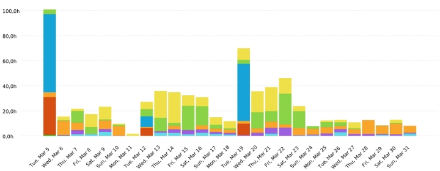

# &nbsp;&nbsp;&nbsp;&nbsp;&nbsp;&nbsp;&nbsp;Time Effort Report - Sprint 2
# &nbsp;&nbsp;&nbsp;&nbsp;&nbsp;&nbsp;&nbsp;&nbsp;&nbsp;&nbsp;&nbsp;&nbsp;&nbsp;&nbsp;&nbsp;&nbsp;&nbsp;&nbsp;&nbsp;&nbsp;&nbsp;&nbsp;&nbsp;&nbsp;&nbsp;&nbsp;&nbsp;&nbsp;&nbsp; NexOng - Grupo 5

***MIEMBROS***:

<table>
  <tr>
    <td>AURORA NAVAS JIMÉNEZ</td>
    <td>MARÍA NÚÑEZ REYES</td>
    <td>CLAUDIA GILABERT PRIETO</td>
  </tr>
  <tr>
    <td>MARTA INÉS GONZÁLEZ DIÁNEZ</td>
    <td>FÉLIX ÁNGEL GUDIEL GÜEMES</td>
    <td>MIGUEL ANGEL ROMALDE DORADO</td>
  </tr>
  <tr>
    <td>FRANCISCO DE ASÍS ROSSO RAMÍREZ</td>
    <td>PABLO PERIÁÑEZ CABRERO</td>
    <td>FRANCISCO JAVIER CALDERÓN RODRÍGUEZ</td>
  </tr>
  <tr>
    <td>PEDRO LOPEZ RUZ</td>
    <td>IVÁN RAMÍREZ LARA</td>
    <td>SAMUEL LUIS RODRÍGUEZ MANESS</td>
  </tr>
  <tr>
    <td>MANUEL ORTIZ BLANCO</td>
    <td>SERGIO AGUAYO OROZCO</td>
    <td>JUAN LUIS RUANO MURIEDAS</td>
  </tr>
  <tr>
    <td>MANUEL FRANCISCO BARCIA JIMENEZ</td>
    <td></td>
    <td></td>
  </tr>
</table>

 

## Registro de cambios
**Versión** | **Fecha** | **Descripción**| **Redacción** | **Revisión**
--- | --- | --- | --- | --- 
1.0.0 | 19/2/2024 | DP 6 | PABLO PERIAÑEZ CABRERO | MARTA INES GONZALEZ DIANEZ
2.0.0 | 4/3/2024 | S1 | PABLO PERIAÑEZ CABRERO | MARTA INES GONZALEZ DIANEZ
3.0.0 | 1/4/2024 | S2 | PABLO PERIAÑEZ CABRERO | MARTA INES GONZALEZ DIANEZ

Project![ref1]

 Front-End - Manos Abiertas con Norte 178:37:01 26,35%

|Back-End - Manos Abiertas con Norte|151:31:23|22,35|
| - | - | - |
|Clases - Manos Abiertas con Norte|116:24:47|17,17|
|Documentación - Manos Abiertas con Norte|115:03:02|16,97|
|Reuniones - Manos Abiertas con Norte|45:38:56|6,73|
|Revisión - Manos Abiertas con Norte|44:44:21|6,60|
|Píldoras teóricas - Manos Abiertas con Norte|25:06:57|3,70|
|NexONG - Manos Abiertas con Norte|00:51:16|0,13|

User![ref1]

 Maria Nuñez Reyes 68:14:15 10,07%

|Miguel Angel Romalde Dorado|40:33:30|5,98|
| - | - | - |
|Iván Ramírez Lara|41:25:04|6,11|
|Claudia Gilabert|45:47:27|6,75|
|Marta Ines Gonzalez Dianez|39:48:55|5,87|

 Félix Ángel Gudiel Güemes 39:46:49 5,87%

|Sergio|39:24:44|5,81|
| - | - | - |
|Samuel Rodríguez Maness|41:31:36|6,13|
|Juan Luis Ruano Muriedas|35:30:51|5,24|
|Pablo Periañez Cabrero|47:59:06|7,08|
|Francisco Calderón|43:05:26|6,36|
|Francisco Rosso|40:25:08|5,96|
|Manuel Barcia|35:08:45|5,18|
|Pedro Lopez ruz|38:47:39|5,72|
|Aurora Navas|46:31:34|6,86|
|Manuel Ortiz Blanco|33:56:54|5,01|

Task![ref1]

 82-Styles - Front-End - Manos Abiertas con Norte 32:29:12 4,79%

|(Without Task)|56:43:52|8,37|
| - | - | - |
|81-Export-Donations - Back-End - Manos Abiertas con Norte|16:02:58|2,37|
|74-75-76-77-128-roles-authorisation - Back-End - Manos Abiertas con|13:40:18|2,02|
|Norte|||
|84-admin-classes-events-projects - Front-End - Manos Abiertas con|13:14:53|1,95|
|Norte|||
|Presentacion - Documentación - Manos Abiertas con Norte|12:54:02|1,90|
|Documentación como código - Documentación - Manos Abiertas con|12:38:42|1,87|
|Norte|||
|80-export-students-data - Back-End - Manos Abiertas con Norte|11:52:10|1,75|
|80-navbar-donations - Front-End - Manos Abiertas con Norte|10:59:22|1,62|
|117-Educators Evaluation - Front-End - Manos Abiertas con Norte|08:43:40|1,29|
|92-download-files-fix-populate - Back-End - Manos Abiertas con Norte|08:18:49|1,23|
|83-profiles-backend - Front-End - Manos Abiertas con Norte|08:14:43|1,22|
|Clases normal - Clases - Manos Abiertas con Norte|63:15:29|9,33|

 7-Admin screen- volunteers and educators - Front-End - Manos 07:57:56 1,17% Abiertas con Norte

|110-email-validation - Back-End - Manos Abiertas con Norte|08:40:14|1,28|
| - | - | - |
|117-Payment-Method - Back-End - Manos Abiertas con Norte|07:39:59|1,13|
|Evaluación - Documentación - Manos Abiertas con Norte|13:44:52|2,03|
|90-VolunteersAgenda - Front-End - Manos Abiertas con Norte|07:14:32|1,07|
|71-check-business-logic - Back-End - Manos Abiertas con Norte|06:13:50|0,92|
|73-admin-authorisasion - Back-End - Manos Abiertas con Norte|05:53:57|0,87|
|8-Admin screen-Partners - Front-End - Manos Abiertas con Norte|05:46:24|0,85|
|102-Kids Evaluation - Front-End - Manos Abiertas con Norte|05:45:04|0,85|
|Backend - Revisión - Manos Abiertas con Norte|22:22:34|3,30|
|62-landing-page - Documentación - Manos Abiertas con Norte|05:26:45|0,80|
|81-navbar-suggestions - Front-End - Manos Abiertas con Norte|05:18:41|0,78|
|84-deploy-S2 - Back-End - Manos Abiertas con Norte|15:20:18|2,26|
|165-feedback-usuarios-piloto - Documentación - Manos Abiertas con|05:15:00|0,77|
|Norte|||
|109-Punctual-Donations-Export - Back-End - Manos Abiertas con|04:58:34|0,73|
|Norte|||
|Team Leader - Documentación - Manos Abiertas con Norte|07:27:53|1,10|
|Clase de evaluación - Clases - Manos Abiertas con Norte|31:35:03|4,66|
|88-Backend-Documentation - Back-End - Manos Abiertas con Norte|10:27:19|1,54|
|Frontend - Revisión - Manos Abiertas con Norte|16:32:12|2,44|
|91-VolunteersAttendence - Front-End - Manos Abiertas con Norte|04:15:27|0,63|
|154-LogIn-and-register-with-token - Front-End - Manos Abiertas con|03:55:49|0,58|
|Norte|||
|125-add-activities-educators - Front-End - Manos Abiertas con Norte|03:53:48|0,57|
|103-update-populate - Back-End - Manos Abiertas con Norte|03:47:17|0,56|
|15-backend-deploy - Back-End - Manos Abiertas con Norte|03:45:00|0,55|

 Reconexión Back-End - Front-End - Manos Abiertas con Norte 06:41:15 0,99%

|Reunión general - Reuniones - Manos Abiertas con Norte|38:16:39|5,65|
| - | - | - |
|Anuncio - Documentación - Manos Abiertas con Norte|07:07:55|1,05|
|115-log-out-button - Front-End - Manos Abiertas con Norte|03:12:48|0,47|
|132-Análisis-costes - Documentación - Manos Abiertas con Norte|03:10:11|0,47|
|92-impacto-legal-del-proyecto - Documentación - Manos Abiertas con|03:05:25|0,46|
|Norte|||
|Organización de Grupo y Matriz RACI - Documentación - Manos|02:52:29|0,42|
|Abiertas con Norte|||
|Peticiones revisores - Front-End - Manos Abiertas con Norte|02:51:58|0,42|
|88-fix88-volunteers-form - Front-End - Manos Abiertas con Norte|02:48:22|0,41|
|72-authentication-framework-google - Back-End - Manos Abiertas con|02:43:13|0,40|
|Norte|||
|119-admin-events - Front-End - Manos Abiertas con Norte|02:35:49|0,38|
|166-suggestion-admin - Front-End - Manos Abiertas con Norte|02:32:35|0,38|
|145-realizar-video-demo-sprint-2 - Documentación - Manos Abiertas|02:32:00|0,37|
|con Norte|||
|Poker planning - Documentación - Manos Abiertas con Norte|04:35:04|0,68|
|117-Educators-Evaluation - Front-End - Manos Abiertas con Norte|04:30:38|0,67|
|118-fix118-admin-partners - Front-End - Manos Abiertas con Norte|02:22:44|0,35|
|143-impacto-legal - Documentación - Manos Abiertas con Norte|02:16:04|0,33|
|85-LogIn - Front-End - Manos Abiertas con Norte|02:12:38|0,33|
|fix/130 - Front-End - Manos Abiertas con Norte|02:08:34|0,32|
|90-suggestions-model - Back-End - Manos Abiertas con Norte|02:03:44|0,30|
|94-CustomerAgreement - Documentación - Manos Abiertas con Norte|02:00:07|0,30|
|87-documentacion-como-codigo - Documentación - Manos Abiertas|02:00:00|0,30|
|con Norte|||
|86-volunteers-profile - Front-End - Manos Abiertas con Norte|01:59:28|0,29|

 FC tems review - Documentación - Manos Abiertas con Norte 03:31:53 0,52%

|163-software-review-guidelines - Documentación - Manos Abiertas|01:58:46|0,29|
| - | - | - |
|con Norte|||
|149- Summer school - Front-End - Manos Abiertas con Norte|01:54:29|0,28|
|Semana 7 - Píldoras teóricas - Manos Abiertas con Norte|17:35:33|2,59|
|121- volunteers event - Front-End - Manos Abiertas con Norte|01:52:27|0,28|
|129-Admin-Families - Front-End - Manos Abiertas con Norte|01:44:48|0,26|
|99-Agenda - Front-End - Manos Abiertas con Norte|01:42:54|0,25|
|122- add educator - Front-End - Manos Abiertas con Norte|01:36:54|0,24|
|Project Manager - Documentación - Manos Abiertas con Norte|01:35:12|0,23|
|101-Admin-Families - Front-End - Manos Abiertas con Norte|01:32:12|0,23|
|97-Educators Component - Front-End - Manos Abiertas con Norte|01:27:33|0,22|
|96-Punctual-Donations-Home-Documents - Back-End - Manos|01:26:48|0,21|
|Abiertas con Norte|||
|124-partners-screen - Front-End - Manos Abiertas con Norte|01:26:09|0,21|
|138-agreement-apendix - Documentación - Manos Abiertas con Norte|01:26:00|0,21|
|100-Deploy - Front-End - Manos Abiertas con Norte|03:54:27|0,58|
|Hotfix/menu - Front-End - Manos Abiertas con Norte|01:21:47|0,20|
|91-VolunteerAttendence+128- Volunteer ageda unsubscribe - Front-|01:20:57|0,20|
|End - Manos Abiertas con Norte|||
|Semana 5 - Píldoras teóricas - Manos Abiertas con Norte|03:18:42|0,49|
|135-commitment-agreement-usuarios-piloto - Documentación - Manos|01:14:53|0,18|
|Abiertas con Norte|||
|168-performance-evaluation - Documentación - Manos Abiertas con|01:14:19|0,18|
|Norte|||
|133-usuarios-pilotos - Documentación - Manos Abiertas con Norte|01:06:21|0,16|
|Story Board - Documentación - Manos Abiertas con Norte|01:06:20|0,16|
|Problemas - Documentación - Manos Abiertas con Norte|01:25:25|0,21|

 147-mission-view-and-values - Front-End - Manos Abiertas con Norte 01:05:06 0,16%

|108-update-readme - Back-End - Manos Abiertas con Norte|01:03:35|0,16|
| - | - | - |
|150-update-images - Front-End - Manos Abiertas con Norte|00:57:45|0,14|
|Docs - Revisión - Manos Abiertas con Norte|04:59:45|0,74|
|10-admin-screen-account-configuration - Front-End - Manos Abiertas|00:55:56|0,14|
|con Norte|||
|79-Export-Volunteers/Volunteer-data - Back-End - Manos Abiertas con|00:54:59|0,14|
|Norte|||
|93-Problemas(W6) - Documentación - Manos Abiertas con Norte|00:50:52|0,13|
|126-Partners-add-button-partners - Front-End - Manos Abiertas con|00:44:47|0,11|
|Norte|||
|146-history-homepage - Front-End - Manos Abiertas con Norte|00:44:00|0,11|
|User Pilots Commitment Agreement - Documentación - Manos|00:42:11|0,10|
|Abiertas con Norte|||
|69-remove authentication - Back-End - Manos Abiertas con Norte|00:42:00|0,10|
|69-Remove-the-authentication-for-frontend - Back-End - Manos|00:40:34|0,10|
|Abiertas con Norte|||
|94-creationVolunteerComponent - Front-End - Manos Abiertas con|00:40:08|0,10|
|Norte|||
|Retrospectiva - Clases - Manos Abiertas con Norte|02:25:11|0,36|
|Semana 8 - Píldoras teóricas - Manos Abiertas con Norte|02:42:47|0,40|
|83-register&login - Back-End - Manos Abiertas con Norte|00:39:22|0,10|
|Uso de IA - Documentación - Manos Abiertas con Norte|01:04:51|0,16|
|Formación - NexONG - Manos Abiertas con Norte|00:38:54|0,10|
|Lecciones Aprendidas - Documentación - Manos Abiertas con Norte|00:33:17|0,08|
|Reunión Front-end - Reuniones - Manos Abiertas con Norte|02:41:09|0,40|
|Configure Tokens auth - Front-End - Manos Abiertas con Norte|00:36:43|0,09|
|Retrospectiva - Documentación - Manos Abiertas con Norte|00:34:27|0,08|

 96-Lecciones-aprendidas(W7) - Documentación - Manos Abiertas con 00:25:00 0,06% Norte

|123-update-homeDocument - Back-End - Manos Abiertas con Norte|00:24:19|0,06|
| - | - | - |
|122-fix122--add-educator - Front-End - Manos Abiertas con Norte|00:22:25|0,06|
|User Pilots - Documentación - Manos Abiertas con Norte|00:21:05|0,05|
|Contacto con Manos Abiertas - Documentación - Manos Abiertas con|00:20:16|0,05|
|Norte|||
|97-Educators-Component - Front-End - Manos Abiertas con Norte|00:20:00|0,05|
|159-hacer-de-usuarios-piloto - Documentación - Manos Abiertas con|01:12:17|0,18|
|Norte|||
|Usuarios Piloto de Aparking - Documentación - Manos Abiertas con|00:45:43|0,11|
|Norte|||
|Poker planning - NexONG - Manos Abiertas con Norte|00:12:22|0,03|
|Requisitos - Documentación - Manos Abiertas con Norte|00:12:20|0,03|
|145-About-Us - Front-End - Manos Abiertas con Norte|00:10:00|0,02|
|User Pilots Performance Evaluation - Documentación - Manos|00:05:00|0,01|
|Abiertas con Norte|||
|Component Integration - Front-End - Manos Abiertas con Norte|00:04:05|0,01|
|Governify - Documentación - Manos Abiertas con Norte|00:03:25|0,01|

Project / User / Task Duration

|Front-End - Manos Abiertas con Norte|178:37:01|
| - | - |
|Maria Nuñez Reyes|39:11:57|
|82-Styles|30:42:32|
|117-Educators-Evaluation|02:05:38|
|129-Admin-Families|01:44:48|

101-Admin-Families 01:32:12

|Hotfix/menu|01:21:47|
| - | - |
|100-Deploy|01:15:00|
|97-Educators-Component|00:20:00|
|145-About-Us|00:10:00|
|Iván Ramírez Lara|27:10:52|
|7-Admin screen- volunteers and educators|07:57:56|
|8-Admin screen-Partners|05:46:24|
|Reconexión Back-End|03:37:39|
|88-fix88-volunteers-form|02:48:22|
|118-fix118-admin-partners|02:22:44|
|149- Summer school|01:54:29|
|122- add educator|01:36:54|
|Configure Tokens auth|00:28:50|
|122-fix122--add-educator|00:22:25|
|(Without Task)|00:15:09|
|Claudia Gilabert|25:59:15|
|117-Educators Evaluation|08:43:40|
|102-Kids Evaluation|05:45:04|
|154-LogIn-and-register-with-token|03:55:49|
|85-LogIn|02:12:38|
|82-Styles|01:46:40|
|97-Educators Component|01:27:33|
|100-Deploy|01:15:11|
|126-Partners-add-button-partners|00:44:47|
|Configure Tokens auth|00:07:53|

Samuel Rodríguez Maness 22:53:30

|84-admin-classes-events-projects|13:14:53|
| - | - |
|125-add-activities-educators|03:53:48|
|119-admin-events|02:35:49|
|117-Educators-Evaluation|02:25:00|
|146-history-homepage|00:44:00|
|Francisco Calderón|20:19:24|
|83-profiles-backend|08:14:43|
|115-log-out-button|03:12:48|
|Peticiones revisores|02:51:58|
|fix/130|02:08:34|
|86-volunteers-profile|01:59:28|
|10-admin-screen-account-configuration|00:55:56|
|Reconexión Back-End|00:51:52|
|Component Integration|00:04:05|
|Francisco Rosso|19:55:44|
|80-navbar-donations|10:59:22|
|81-navbar-suggestions|05:18:41|
|166-suggestion-admin|02:32:35|
|147-mission-view-and-values|01:05:06|
|Manuel Barcia|17:35:15|
|90-VolunteersAgenda|07:14:32|
|91-VolunteersAttendence|04:15:27|
|Reconexión Back-End|02:11:44|
|121- volunteers event|01:52:27|
|91-VolunteerAttendence+128- Volunteer ageda unsubscribe|01:20:57|

94-creationVolunteerComponent 00:40:08

|Marta Ines Gonzalez Dianez|05:31:04|
| - | - |
|99-Agenda|01:42:54|
|124-partners-screen|01:26:09|
|100-Deploy|01:24:16|
|150-update-images|00:57:45|
|Back-End - Manos Abiertas con Norte|151:31:23|
|Miguel Angel Romalde Dorado|30:08:19|
|81-Export-Donations|16:02:58|
|117-Payment-Method|07:39:59|
|109-Punctual-Donations-Export|04:58:34|
|96-Punctual-Donations-Home-Documents|01:26:48|
|Félix Ángel Gudiel Güemes|24:02:33|
|92-download-files-fix-populate|08:18:49|
|71-check-business-logic|06:13:50|
|84-deploy-S2|05:18:18|
|103-update-populate|03:47:17|
|123-update-homeDocument|00:24:19|
|Sergio|22:58:06|
|(Without Task)|22:58:06|
|Juan Luis Ruano Muriedas|21:09:48|
|74-75-76-77-128-roles-authorisation|13:40:18|
|73-admin-authorisasion|05:53:57|
|79-Export-Volunteers/Volunteer-data|00:54:59|
|69-Remove-the-authentication-for-frontend|00:40:34|
|Pedro Lopez ruz|15:43:22|

80-export-students-data 11:09:36

|88-Backend-Documentation|03:37:04|
| - | - |
|110-email-validation|00:56:42|
|Aurora Navas|14:35:32|
|84-deploy-S2|05:00:00|
|15-backend-deploy|03:45:00|
|72-authentication-framework-google|02:43:13|
|90-suggestions-model|02:03:44|
|108-update-readme|01:03:35|
|Manuel Ortiz Blanco|12:59:06|
|110-email-validation|07:43:32|
|88-Backend-Documentation|04:33:00|
|80-export-students-data|00:42:34|
|Pablo Periañez Cabrero|08:40:37|
|84-deploy-S2|05:02:00|
|88-Backend-Documentation|02:17:15|
|69-remove authentication|00:42:00|
|83-register&login|00:39:22|
|Samuel Rodríguez Maness|01:14:00|
|(Without Task)|01:14:00|
|Clases - Manos Abiertas con Norte|116:24:47|
|Pedro Lopez ruz|08:45:00|
|Clases normal|08:05:00|
|Retrospectiva|00:40:00|
|Manuel Ortiz Blanco|08:35:00|
|Clase de evaluación|04:35:00|

Clases normal 04:00:00

|Francisco Rosso|08:21:11|
| - | - |
|Clases normal|04:24:41|
|(Without Task)|03:56:30|
|Félix Ángel Gudiel Güemes|08:16:00|
|Clases normal|07:41:00|
|Clase de evaluación|00:35:00|
|Manuel Barcia|08:15:00|
|Clase de evaluación|03:50:00|
|Clases normal|03:50:00|
|Retrospectiva|00:35:00|
|Pablo Periañez Cabrero|08:15:00|
|Clases normal|04:25:00|
|Clase de evaluación|03:50:00|
|Aurora Navas|08:15:00|
|Clases normal|04:25:00|
|Clase de evaluación|03:50:00|
|Juan Luis Ruano Muriedas|07:55:23|
|Clases normal|04:08:20|
|Clase de evaluación|03:47:03|
|Claudia Gilabert|07:55:00|
|Clase de evaluación|03:40:00|
|Clases normal|03:40:00|
|Retrospectiva|00:35:00|
|Francisco Calderón|07:51:01|
|(Without Task)|04:02:19|

Clases normal 03:13:31

|Retrospectiva|00:35:11|
| - | - |
|Maria Nuñez Reyes|07:50:57|
|Clase de evaluación|03:58:00|
|Clases normal|03:52:57|
|Iván Ramírez Lara|06:40:15|
|(Without Task)|06:40:15|
|Samuel Rodríguez Maness|06:35:00|
|Clases normal|06:35:00|
|Miguel Angel Romalde Dorado|04:55:00|
|Clases normal|04:55:00|
|Sergio|04:30:00|
|(Without Task)|04:30:00|
|Marta Ines Gonzalez Dianez|03:30:00|
|Clase de evaluación|03:30:00|
|Documentación - Manos Abiertas con Norte|115:03:02|
|Marta Ines Gonzalez Dianez|24:29:50|
|Presentacion|11:37:06|
|Evaluación|05:42:23|
|Anuncio|03:33:03|
|Project Manager|01:35:12|
|Story Board|01:06:20|
|Retrospectiva|00:25:27|
|Usuarios Piloto de Aparking|00:17:59|
|Requisitos|00:12:20|
|Pablo Periañez Cabrero|20:28:53|

Evaluación 07:38:42

|Team Leader|04:55:41|
| - | - |
|Anuncio|03:34:52|
|Poker planning|02:29:39|
|138-agreement-apendix|01:26:00|
|Presentacion|00:23:59|
|Maria Nuñez Reyes|13:39:14|
|Documentación como código|11:24:42|
|(Without Task)|01:03:56|
|User Pilots Commitment Agreement|00:42:11|
|Problemas|00:20:00|
|User Pilots Performance Evaluation|00:05:00|
|Governify|00:03:25|
|Aurora Navas|13:23:01|
|165-feedback-usuarios-piloto|05:15:00|
|87-documentacion-como-codigo|02:00:00|
|163-software-review-guidelines|01:58:46|
|135-commitment-agreement-usuarios-piloto|01:14:53|
|168-performance-evaluation|01:14:19|
|133-usuarios-pilotos|01:06:21|
|Contacto con Manos Abiertas|00:20:16|
|159-hacer-de-usuarios-piloto|00:13:26|
|Pedro Lopez ruz|07:43:10|
|Organización de Grupo y Matriz RACI|02:52:29|
|FC tems review|01:32:59|
|Documentación como código|01:14:00|

Problemas 01:05:25

|Lecciones Aprendidas|00:33:17|
| - | - |
|159-hacer-de-usuarios-piloto|00:16:00|
|Retrospectiva|00:09:00|
|Francisco Calderón|05:40:06|
|62-landing-page|05:26:45|
|Usuarios Piloto de Aparking|00:13:21|
|Francisco Rosso|05:21:29|
|92-impacto-legal-del-proyecto|03:05:25|
|143-impacto-legal|02:16:04|
|Sergio|05:19:51|
|(Without Task)|04:58:46|
|User Pilots|00:21:05|
|Manuel Ortiz Blanco|04:43:32|
|Poker planning|02:05:25|
|FC tems review|01:58:54|
|Uso de IA|00:39:13|
|Samuel Rodríguez Maness|04:06:42|
|145-realizar-video-demo-sprint-2|02:32:00|
|93-Problemas(W6)|00:50:52|
|96-Lecciones-aprendidas(W7)|00:25:00|
|159-hacer-de-usuarios-piloto|00:18:50|
|Claudia Gilabert|03:58:54|
|Team Leader|02:32:12|
|Presentacion|00:52:57|
|Evaluación|00:23:47|

159-hacer-de-usuarios-piloto 00:09:58

|Miguel Angel Romalde Dorado|03:10:11|
| - | - |
|132-Análisis-costes|03:10:11|
|Manuel Barcia|02:00:07|
|94-CustomerAgreement|02:00:07|
|Félix Ángel Gudiel Güemes|00:40:01|
|Uso de IA|00:25:38|
|Usuarios Piloto de Aparking|00:14:23|
|Juan Luis Ruano Muriedas|00:14:03|
|159-hacer-de-usuarios-piloto|00:14:03|
|Iván Ramírez Lara|00:03:58|
|(Without Task)|00:03:58|
|Reuniones - Manos Abiertas con Norte|45:38:56|
|Marta Ines Gonzalez Dianez|04:03:41|
|Reunión general|03:36:12|
|Reunión Front-end|00:27:29|
|Claudia Gilabert|03:32:29|
|Reunión general|03:03:30|
|Reunión Front-end|00:28:59|
|Pablo Periañez Cabrero|03:29:39|
|Reunión general|03:29:39|
|Iván Ramírez Lara|03:13:52|
|(Without Task)|02:45:08|
|Reunión Front-end|00:28:44|
|Francisco Rosso|03:12:39|
|Reunión general|02:44:20|

Reunión Front-end 00:28:19

|Francisco Calderón|03:09:52|
| - | - |
|Reunión general|03:09:52|
|Sergio|03:05:02|
|Reunión general|03:05:02|
|Pedro Lopez ruz|02:56:00|
|Reunión general|02:56:00|
|Juan Luis Ruano Muriedas|02:48:52|
|Reunión general|02:48:52|
|Aurora Navas|02:48:00|
|Reunión general|02:48:00|
|Manuel Ortiz Blanco|02:45:00|
|Reunión general|02:45:00|
|Félix Ángel Gudiel Güemes|02:44:28|
|(Without Task)|01:56:00|
|Reunión general|00:48:28|
|Samuel Rodríguez Maness|02:13:00|
|Reunión general|01:43:00|
|Reunión Front-end|00:30:00|
|Miguel Angel Romalde Dorado|01:56:48|
|Reunión general|01:56:48|
|Maria Nuñez Reyes|01:50:44|
|Reunión general|01:33:06|
|Reunión Front-end|00:17:38|
|Manuel Barcia|01:48:50|
|Reunión general|01:48:50|

Revisión - Manos Abiertas con Norte 44:44:21

|Aurora Navas|06:07:01|
| - | - |
|Backend|05:43:54|
|Docs|00:23:07|
|Pablo Periañez Cabrero|05:39:43|
|Backend|05:39:43|
|Maria Nuñez Reyes|05:06:43|
|Frontend|04:18:45|
|Docs|00:47:58|
|Manuel Ortiz Blanco|03:27:11|
|Backend|02:36:18|
|Docs|00:50:53|
|Francisco Calderón|03:13:21|
|Frontend|02:16:39|
|Docs|00:56:42|
|Claudia Gilabert|02:53:01|
|Frontend|01:57:43|
|(Without Task)|00:49:50|
|Docs|00:05:28|
|Félix Ángel Gudiel Güemes|02:44:47|
|Backend|02:44:47|
|Manuel Barcia|02:43:00|
|Frontend|02:25:36|
|Backend|00:08:53|
|Docs|00:08:31|
|Samuel Rodríguez Maness|02:34:24|

Frontend 01:56:35

|Docs|00:37:49|
| - | - |
|Iván Ramírez Lara|02:21:59|
|Frontend|02:21:59|
|Pedro Lopez ruz|02:14:05|
|Backend|01:54:04|
|Docs|00:20:01|
|Sergio|02:01:50|
|Backend|02:01:50|
|Francisco Rosso|01:14:55|
|Frontend|01:14:55|
|Juan Luis Ruano Muriedas|01:09:53|
|Backend|01:09:53|
|Marta Ines Gonzalez Dianez|00:49:16|
|Docs|00:49:16|
|Miguel Angel Romalde Dorado|00:23:12|
|Backend|00:23:12|
|Píldoras teóricas - Manos Abiertas con Norte|25:06:57|
|Francisco Calderón|02:51:42|
|Semana 7|01:20:16|
|Semana 5|01:15:51|
|Semana 8|00:15:35|
|Manuel Barcia|02:46:33|
|Semana 7|01:16:33|
|Semana 5|01:15:00|
|Semana 8|00:15:00|

Juan Luis Ruano Muriedas 02:12:52

|Semana 7|01:14:01|
| - | - |
|Semana 5|00:47:51|
|Semana 8|00:11:00|
|Samuel Rodríguez Maness|01:55:00|
|Semana 7|01:15:00|
|Semana 8|00:40:00|
|Iván Ramírez Lara|01:54:08|
|Semana 7|01:54:08|
|Sergio|01:29:55|
|(Without Task)|01:29:55|
|Claudia Gilabert|01:28:48|
|Semana 7|01:12:50|
|Semana 8|00:15:58|
|Francisco Rosso|01:27:54|
|Semana 7|01:16:53|
|Semana 8|00:11:01|
|Manuel Ortiz Blanco|01:27:05|
|Semana 7|01:16:01|
|Semana 8|00:11:04|
|Pedro Lopez ruz|01:26:02|
|Semana 7|01:15:02|
|Semana 8|00:11:00|
|Pablo Periañez Cabrero|01:25:14|
|Semana 7|01:14:05|
|Semana 8|00:11:09|

Marta Ines Gonzalez Dianez 01:25:04

|Semana 7|01:25:04|
| - | - |
|Aurora Navas|01:23:00|
|Semana 7|01:13:00|
|Semana 8|00:10:00|
|Félix Ángel Gudiel Güemes|01:19:00|
|Semana 7|01:08:00|
|Semana 8|00:11:00|
|Maria Nuñez Reyes|00:34:40|
|Semana 7|00:34:40|
|NexONG - Manos Abiertas con Norte|00:51:16|
|Francisco Rosso|00:51:16|
|Formación|00:38:54|

Poker planning 00:12:22
ISPP ONG       Created with Clockify       21

[ref1]: Aspose.Words.d1cabf34-a6ad-4fae-9683-f27527c3535b.003.png
