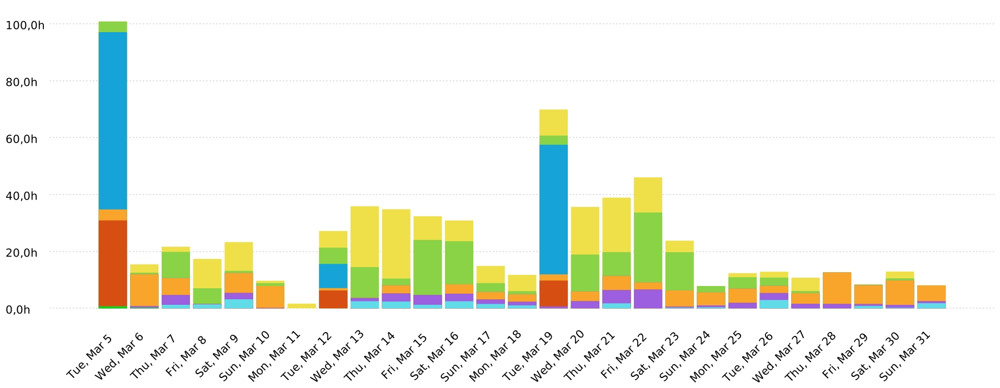
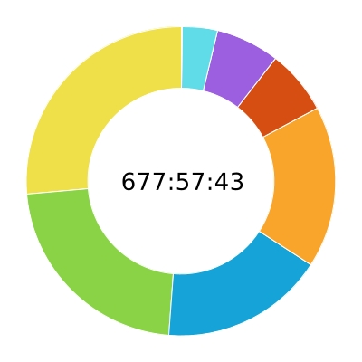
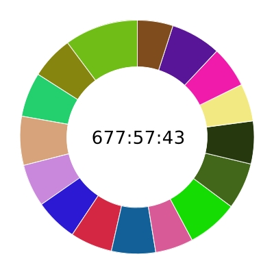
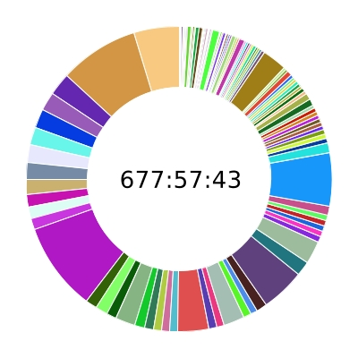

>  style="width:2.08333in;height:0.53028in" />Summary report 05/03/2024 -
> 31/03/2024
>
> Total: 677:57:43

Project

> Front-End - Manos Abiertas con Norte
>
> Back-End - Manos Abiertas con Norte
>
> Clases - Manos Abiertas con Norte
>
> Documentación - Manos Abiertas con Norte
>
> Reuniones - Manos Abiertas con Norte
>
> Revisión - Manos Abiertas con Norte
>
> Píldoras teóricas - Manos Abiertas con Norte
>
> NexONG - Manos Abiertas con Norte

178:37:01 26,35%

151:31:23 22,35%

116:24:47 17,17%

115:03:02 16,97%

> 45:38:56 6,73%
>
> 44:44:21 6,60%
>
> 25:06:57 3,70%
>
> 00:51:16 0,13%

User

> Maria Nuñez Reyes
>
> Miguel Angel Romalde Dorado
>
> Iván Ramírez Lara
>
> Claudia Gilabert
>
> Marta Ines Gonzalez Dianez

68:14:15 10,07%

40:33:30 5,98%

41:25:04 6,11%

45:47:27 6,75%

39:48:55 5,87%

> ISPP ONG Created with Clockify 1
>
> Félix Ángel Gudiel Güemes
>
> Sergio
>
> Samuel Rodríguez Maness
>
> Juan Luis Ruano Muriedas
>
> Pablo Periañez Cabrero
>
> Francisco Calderón
>
> Francisco Rosso
>
> Manuel Barcia
>
> Pedro Lopez ruz
>
> Aurora Navas
>
> Manuel Ortiz Blanco

39:46:49 5,87%

39:24:44 5,81%

41:31:36 6,13%

35:30:51 5,24%

47:59:06 7,08%

43:05:26 6,36%

40:25:08 5,96%

35:08:45 5,18%

38:47:39 5,72%

46:31:34 6,86%

33:56:54 5,01%

Task

> 82-Styles - Front-End - Manos Abiertas con Norte
>
> (Without Task)
>
> 81-Export-Donations - Back-End - Manos Abiertas con Norte
>
> 74-75-76-77-128-roles-authorisation - Back-End - Manos Abiertas con
> Norte
>
> 84-admin-classes-events-projects - Front-End - Manos Abiertas con
> Norte
>
> Presentacion - Documentación - Manos Abiertas con Norte
>
> Documentación como código - Documentación - Manos Abiertas con Norte
>
> 80-export-students-data - Back-End - Manos Abiertas con Norte
>
> 80-navbar-donations - Front-End - Manos Abiertas con Norte
>
> 117-Educators Evaluation - Front-End - Manos Abiertas con Norte
>
> 92-download-files-fix-populate - Back-End - Manos Abiertas con Norte
>
> 83-profiles-backend - Front-End - Manos Abiertas con Norte
>
> Clases normal - Clases - Manos Abiertas con Norte

32:29:12 4,79%

56:43:52 8,37%

16:02:58 2,37%

13:40:18 2,02%

13:14:53 1,95%

12:54:02 1,90%

12:38:42 1,87%

11:52:10 1,75%

10:59:22 1,62%

08:43:40 1,29%

08:18:49 1,23%

08:14:43 1,22%

63:15:29 9,33%

> ISPP ONG Created with Clockify 2
>
> 7-Admin screen- volunteers and educators - Front-End - Manos Abiertas
> con Norte
>
> 110-email-validation - Back-End - Manos Abiertas con Norte
>
> 117-Payment-Method - Back-End - Manos Abiertas con Norte
>
> Evaluación - Documentación - Manos Abiertas con Norte
>
> 90-VolunteersAgenda - Front-End - Manos Abiertas con Norte
>
> 71-check-business-logic - Back-End - Manos Abiertas con Norte
>
> 73-admin-authorisasion - Back-End - Manos Abiertas con Norte
>
> 8-Admin screen-Partners - Front-End - Manos Abiertas con Norte
>
> 102-Kids Evaluation - Front-End - Manos Abiertas con Norte
>
> Backend - Revisión - Manos Abiertas con Norte
>
> 62-landing-page - Documentación - Manos Abiertas con Norte
>
> 81-navbar-suggestions - Front-End - Manos Abiertas con Norte
>
> 84-deploy-S2 - Back-End - Manos Abiertas con Norte
>
> 165-feedback-usuarios-piloto - Documentación - Manos Abiertas con
> Norte
>
> 109-Punctual-Donations-Export - Back-End - Manos Abiertas con Norte
>
> Team Leader - Documentación - Manos Abiertas con Norte
>
> Clase de evaluación - Clases - Manos Abiertas con Norte
>
> 88-Backend-Documentation - Back-End - Manos Abiertas con Norte
>
> Frontend - Revisión - Manos Abiertas con Norte
>
> 91-VolunteersAttendence - Front-End - Manos Abiertas con Norte
>
> 154-LogIn-and-register-with-token - Front-End - Manos Abiertas con
> Norte
>
> 125-add-activities-educators - Front-End - Manos Abiertas con Norte
>
> 103-update-populate - Back-End - Manos Abiertas con Norte
>
> 15-backend-deploy - Back-End - Manos Abiertas con Norte

07:57:56 1,17%

08:40:14 1,28%

07:39:59 1,13%

13:44:52 2,03%

07:14:32 1,07%

06:13:50 0,92%

05:53:57 0,87%

05:46:24 0,85%

05:45:04 0,85%

22:22:34 3,30%

05:26:45 0,80%

05:18:41 0,78%

15:20:18 2,26%

05:15:00 0,77%

04:58:34 0,73%

07:27:53 1,10%

31:35:03 4,66%

10:27:19 1,54%

16:32:12 2,44%

04:15:27 0,63%

03:55:49 0,58%

03:53:48 0,57%

03:47:17 0,56%

03:45:00 0,55%

> ISPP ONG Created with Clockify 3
>
> Reconexión Back-End - Front-End - Manos Abiertas con Norte
>
> Reunión general - Reuniones - Manos Abiertas con Norte
>
> Anuncio - Documentación - Manos Abiertas con Norte
>
> 115-log-out-button - Front-End - Manos Abiertas con Norte
>
> 132-Análisis-costes - Documentación - Manos Abiertas con Norte
>
> 92-impacto-legal-del-proyecto - Documentación - Manos Abiertas con
> Norte
>
> Organización de Grupo y Matriz RACI - Documentación - Manos Abiertas
> con Norte
>
> Peticiones revisores - Front-End - Manos Abiertas con Norte
>
> 88-fix88-volunteers-form - Front-End - Manos Abiertas con Norte
>
> 72-authentication-framework-google - Back-End - Manos Abiertas con
> Norte
>
> 119-admin-events - Front-End - Manos Abiertas con Norte
>
> 166-suggestion-admin - Front-End - Manos Abiertas con Norte
>
> 145-realizar-video-demo-sprint-2 - Documentación - Manos Abiertas con
> Norte
>
> Poker planning - Documentación - Manos Abiertas con Norte
>
> 117-Educators-Evaluation - Front-End - Manos Abiertas con Norte
>
> 118-fix118-admin-partners - Front-End - Manos Abiertas con Norte
>
> 143-impacto-legal - Documentación - Manos Abiertas con Norte
>
> 85-LogIn - Front-End - Manos Abiertas con Norte
>
> fix/130 - Front-End - Manos Abiertas con Norte
>
> 90-suggestions-model - Back-End - Manos Abiertas con Norte
>
> 94-CustomerAgreement - Documentación - Manos Abiertas con Norte
>
> 87-documentacion-como-codigo - Documentación - Manos Abiertas con
> Norte
>
> 86-volunteers-profile - Front-End - Manos Abiertas con Norte

06:41:15 0,99%

38:16:39 5,65%

07:07:55 1,05%

03:12:48 0,47%

03:10:11 0,47%

03:05:25 0,46%

02:52:29 0,42%

02:51:58 0,42%

02:48:22 0,41%

02:43:13 0,40%

02:35:49 0,38%

02:32:35 0,38%

02:32:00 0,37%

04:35:04 0,68%

04:30:38 0,67%

02:22:44 0,35%

02:16:04 0,33%

02:12:38 0,33%

02:08:34 0,32%

02:03:44 0,30%

02:00:07 0,30%

02:00:00 0,30%

01:59:28 0,29%

> ISPP ONG Created with Clockify 4
>
> FC tems review - Documentación - Manos Abiertas con Norte
>
> 163-software-review-guidelines - Documentación - Manos Abiertas con
> Norte
>
> 149- Summer school - Front-End - Manos Abiertas con Norte
>
> Semana 7 - Píldoras teóricas - Manos Abiertas con Norte
>
> 121- volunteers event - Front-End - Manos Abiertas con Norte
>
> 129-Admin-Families - Front-End - Manos Abiertas con Norte
>
> 99-Agenda - Front-End - Manos Abiertas con Norte
>
> 122- add educator - Front-End - Manos Abiertas con Norte
>
> Project Manager - Documentación - Manos Abiertas con Norte
>
> 101-Admin-Families - Front-End - Manos Abiertas con Norte
>
> 97-Educators Component - Front-End - Manos Abiertas con Norte
>
> 96-Punctual-Donations-Home-Documents - Back-End - Manos Abiertas con
> Norte
>
> 124-partners-screen - Front-End - Manos Abiertas con Norte
>
> 138-agreement-apendix - Documentación - Manos Abiertas con Norte
>
> 100-Deploy - Front-End - Manos Abiertas con Norte
>
> Hotfix/menu - Front-End - Manos Abiertas con Norte
>
> 91-VolunteerAttendence+128- Volunteer ageda unsubscribe - Front-End -
> Manos Abiertas con Norte
>
> Semana 5 - Píldoras teóricas - Manos Abiertas con Norte
>
> 135-commitment-agreement-usuarios-piloto - Documentación - Manos
> Abiertas con Norte
>
> 168-performance-evaluation - Documentación - Manos Abiertas con Norte
>
> 133-usuarios-pilotos - Documentación - Manos Abiertas con Norte
>
> Story Board - Documentación - Manos Abiertas con Norte
>
> Problemas - Documentación - Manos Abiertas con Norte

03:31:53 0,52%

01:58:46 0,29%

01:54:29 0,28%

17:35:33 2,59%

01:52:27 0,28%

01:44:48 0,26%

01:42:54 0,25%

01:36:54 0,24%

01:35:12 0,23%

01:32:12 0,23%

01:27:33 0,22%

01:26:48 0,21%

01:26:09 0,21%

01:26:00 0,21%

03:54:27 0,58%

01:21:47 0,20%

01:20:57 0,20%

03:18:42 0,49%

01:14:53 0,18%

01:14:19 0,18%

01:06:21 0,16%

01:06:20 0,16%

01:25:25 0,21%

> ISPP ONG Created with Clockify 5
>
> 147-mission-view-and-values - Front-End - Manos Abiertas con Norte
>
> 108-update-readme - Back-End - Manos Abiertas con Norte
>
> 150-update-images - Front-End - Manos Abiertas con Norte
>
> Docs - Revisión - Manos Abiertas con Norte
>
> 10-admin-screen-account-configuration - Front-End - Manos Abiertas con
> Norte
>
> 79-Export-Volunteers/Volunteer-data - Back-End - Manos Abiertas con
> Norte
>
> 93-Problemas(W6) - Documentación - Manos Abiertas con Norte
>
> 126-Partners-add-button-partners - Front-End - Manos Abiertas con
> Norte
>
> 146-history-homepage - Front-End - Manos Abiertas con Norte
>
> User Pilots Commitment Agreement - Documentación - Manos Abiertas con
> Norte
>
> 69-remove authentication - Back-End - Manos Abiertas con Norte
>
> 69-Remove-the-authentication-for-frontend - Back-End - Manos Abiertas
> con Norte
>
> 94-creationVolunteerComponent - Front-End - Manos Abiertas con Norte
>
> Retrospectiva - Clases - Manos Abiertas con Norte
>
> Semana 8 - Píldoras teóricas - Manos Abiertas con Norte
>
> 83-register&login - Back-End - Manos Abiertas con Norte
>
> Uso de IA - Documentación - Manos Abiertas con Norte
>
> Formación - NexONG - Manos Abiertas con Norte
>
> Lecciones Aprendidas - Documentación - Manos Abiertas con Norte
>
> Reunión Front-end - Reuniones - Manos Abiertas con Norte
>
> Configure Tokens auth - Front-End - Manos Abiertas con Norte
>
> Retrospectiva - Documentación - Manos Abiertas con Norte

01:05:06 0,16%

01:03:35 0,16%

00:57:45 0,14%

04:59:45 0,74%

00:55:56 0,14%

00:54:59 0,14%

00:50:52 0,13%

00:44:47 0,11%

00:44:00 0,11%

00:42:11 0,10%

00:42:00 0,10%

00:40:34 0,10%

00:40:08 0,10%

02:25:11 0,36%

02:42:47 0,40%

00:39:22 0,10%

01:04:51 0,16%

00:38:54 0,10%

00:33:17 0,08%

02:41:09 0,40%

00:36:43 0,09%

00:34:27 0,08%

> ISPP ONG Created with Clockify 6
>
> 96-Lecciones-aprendidas(W7) - Documentación - Manos Abiertas con Norte
>
> 123-update-homeDocument - Back-End - Manos Abiertas con Norte
>
> 122-fix122--add-educator - Front-End - Manos Abiertas con Norte
>
> User Pilots - Documentación - Manos Abiertas con Norte
>
> Contacto con Manos Abiertas - Documentación - Manos Abiertas con Norte
>
> 97-Educators-Component - Front-End - Manos Abiertas con Norte
>
> 159-hacer-de-usuarios-piloto - Documentación - Manos Abiertas con
> Norte
>
> Usuarios Piloto de Aparking - Documentación - Manos Abiertas con Norte
>
> Poker planning - NexONG - Manos Abiertas con Norte
>
> Requisitos - Documentación - Manos Abiertas con Norte
>
> 145-About-Us - Front-End - Manos Abiertas con Norte
>
> User Pilots Performance Evaluation - Documentación - Manos Abiertas
> con Norte
>
> Component Integration - Front-End - Manos Abiertas con Norte
>
> Governify - Documentación - Manos Abiertas con Norte

00:25:00 0,06%

00:24:19 0,06%

00:22:25 0,06%

00:21:05 0,05%

00:20:16 0,05%

00:20:00 0,05%

01:12:17 0,18%

00:45:43 0,11%

00:12:22 0,03%

00:12:20 0,03%

00:10:00 0,02%

00:05:00 0,01%

00:04:05 0,01%

00:03:25 0,01%

Project / User / Task

Front-End - Manos Abiertas con Norte

> Maria Nuñez Reyes
>
> 82-Styles
>
> 117-Educators-Evaluation
>
> 129-Admin-Families
>
> 101-Admin-Families
>
> Duration

178:37:01

> 39:11:57
>
> 30:42:32
>
> 02:05:38
>
> 01:44:48
>
> 01:32:12
>
> ISPP ONG Created with Clockify 7
>
> Hotfix/menu
>
> 100-Deploy
>
> 97-Educators-Component
>
> 145-About-Us

Iván Ramírez Lara

> 7-Admin screen- volunteers and educators
>
> 8-Admin screen-Partners
>
> Reconexión Back-End
>
> 88-fix88-volunteers-form
>
> 118-fix118-admin-partners
>
> 149- Summer school
>
> 122- add educator
>
> Configure Tokens auth
>
> 122-fix122--add-educator
>
> (Without Task)

Claudia Gilabert

> 117-Educators Evaluation
>
> 102-Kids Evaluation
>
> 154-LogIn-and-register-with-token
>
> 85-LogIn
>
> 82-Styles
>
> 97-Educators Component
>
> 100-Deploy
>
> 126-Partners-add-button-partners
>
> Configure Tokens auth

Samuel Rodríguez Maness

> 01:21:47
>
> 01:15:00
>
> 00:20:00
>
> 00:10:00

27:10:52

> 07:57:56
>
> 05:46:24
>
> 03:37:39
>
> 02:48:22
>
> 02:22:44
>
> 01:54:29
>
> 01:36:54
>
> 00:28:50
>
> 00:22:25
>
> 00:15:09

25:59:15

> 08:43:40
>
> 05:45:04
>
> 03:55:49
>
> 02:12:38
>
> 01:46:40
>
> 01:27:33
>
> 01:15:11
>
> 00:44:47
>
> 00:07:53

22:53:30

> ISPP ONG Created with Clockify 8
>
> 84-admin-classes-events-projects
>
> 125-add-activities-educators
>
> 119-admin-events
>
> 117-Educators-Evaluation
>
> 146-history-homepage

Francisco Calderón

> 83-profiles-backend
>
> 115-log-out-button
>
> Peticiones revisores
>
> fix/130
>
> 86-volunteers-profile
>
> 10-admin-screen-account-configuration
>
> Reconexión Back-End
>
> Component Integration

Francisco Rosso

> 80-navbar-donations
>
> 81-navbar-suggestions
>
> 166-suggestion-admin
>
> 147-mission-view-and-values

Manuel Barcia

> 90-VolunteersAgenda
>
> 91-VolunteersAttendence
>
> Reconexión Back-End
>
> 121- volunteers event
>
> 91-VolunteerAttendence+128- Volunteer ageda unsubscribe
>
> 94-creationVolunteerComponent
>
> 13:14:53
>
> 03:53:48
>
> 02:35:49
>
> 02:25:00
>
> 00:44:00

20:19:24

> 08:14:43
>
> 03:12:48
>
> 02:51:58
>
> 02:08:34
>
> 01:59:28
>
> 00:55:56
>
> 00:51:52
>
> 00:04:05

19:55:44

> 10:59:22
>
> 05:18:41
>
> 02:32:35
>
> 01:05:06

17:35:15

> 07:14:32
>
> 04:15:27
>
> 02:11:44
>
> 01:52:27
>
> 01:20:57
>
> 00:40:08
>
> ISPP ONG Created with Clockify 9
>
> Marta Ines Gonzalez Dianez
>
> 99-Agenda
>
> 124-partners-screen
>
> 100-Deploy
>
> 150-update-images

Back-End - Manos Abiertas con Norte

> Miguel Angel Romalde Dorado
>
> 81-Export-Donations
>
> 117-Payment-Method
>
> 109-Punctual-Donations-Export
>
> 96-Punctual-Donations-Home-Documents
>
> Félix Ángel Gudiel Güemes
>
> 92-download-files-fix-populate
>
> 71-check-business-logic
>
> 84-deploy-S2
>
> 103-update-populate
>
> 123-update-homeDocument
>
> Sergio
>
> (Without Task)
>
> Juan Luis Ruano Muriedas
>
> 74-75-76-77-128-roles-authorisation
>
> 73-admin-authorisasion
>
> 79-Export-Volunteers/Volunteer-data
>
> 69-Remove-the-authentication-for-frontend
>
> Pedro Lopez ruz
>
> 80-export-students-data
>
> 05:31:04
>
> 01:42:54
>
> 01:26:09
>
> 01:24:16
>
> 00:57:45

151:31:23

> 30:08:19
>
> 16:02:58
>
> 07:39:59
>
> 04:58:34
>
> 01:26:48
>
> 24:02:33
>
> 08:18:49
>
> 06:13:50
>
> 05:18:18
>
> 03:47:17
>
> 00:24:19
>
> 22:58:06
>
> 22:58:06
>
> 21:09:48
>
> 13:40:18
>
> 05:53:57
>
> 00:54:59
>
> 00:40:34
>
> 15:43:22
>
> 11:09:36
>
> ISPP ONG Created with Clockify 10
>
> 88-Backend-Documentation
>
> 110-email-validation
>
> Aurora Navas
>
> 84-deploy-S2
>
> 15-backend-deploy
>
> 72-authentication-framework-google
>
> 90-suggestions-model
>
> 108-update-readme
>
> Manuel Ortiz Blanco
>
> 110-email-validation
>
> 88-Backend-Documentation
>
> 80-export-students-data
>
> Pablo Periañez Cabrero
>
> 84-deploy-S2
>
> 88-Backend-Documentation
>
> 69-remove authentication
>
> 83-register&login
>
> Samuel Rodríguez Maness
>
> (Without Task)

Clases - Manos Abiertas con Norte

> Pedro Lopez ruz
>
> Clases normal
>
> Retrospectiva
>
> Manuel Ortiz Blanco
>
> Clase de evaluación
>
> Clases normal
>
> 03:37:04
>
> 00:56:42
>
> 14:35:32
>
> 05:00:00
>
> 03:45:00
>
> 02:43:13
>
> 02:03:44
>
> 01:03:35
>
> 12:59:06
>
> 07:43:32
>
> 04:33:00
>
> 00:42:34
>
> 08:40:37
>
> 05:02:00
>
> 02:17:15
>
> 00:42:00
>
> 00:39:22
>
> 01:14:00
>
> 01:14:00

116:24:47

> 08:45:00
>
> 08:05:00
>
> 00:40:00
>
> 08:35:00
>
> 04:35:00
>
> 04:00:00
>
> ISPP ONG Created with Clockify 11

Francisco Rosso

> Clases normal
>
> (Without Task)

Félix Ángel Gudiel Güemes

> Clases normal
>
> Clase de evaluación

Manuel Barcia

> Clase de evaluación
>
> Clases normal
>
> Retrospectiva

Pablo Periañez Cabrero

> Clases normal
>
> Clase de evaluación

Aurora Navas

> Clases normal
>
> Clase de evaluación

Juan Luis Ruano Muriedas

> Clases normal
>
> Clase de evaluación

Claudia Gilabert

> Clase de evaluación
>
> Clases normal
>
> Retrospectiva

Francisco Calderón

> (Without Task)
>
> Clases normal

08:21:11

> 04:24:41
>
> 03:56:30

08:16:00

> 07:41:00
>
> 00:35:00

08:15:00

> 03:50:00
>
> 03:50:00
>
> 00:35:00

08:15:00

> 04:25:00
>
> 03:50:00

08:15:00

> 04:25:00
>
> 03:50:00

07:55:23

> 04:08:20
>
> 03:47:03

07:55:00

> 03:40:00
>
> 03:40:00
>
> 00:35:00

07:51:01

> 04:02:19
>
> 03:13:31
>
> ISPP ONG Created with Clockify 12
>
> Retrospectiva
>
> Maria Nuñez Reyes
>
> Clase de evaluación
>
> Clases normal
>
> Iván Ramírez Lara
>
> (Without Task)
>
> Samuel Rodríguez Maness
>
> Clases normal
>
> Miguel Angel Romalde Dorado
>
> Clases normal
>
> Sergio
>
> (Without Task)
>
> Marta Ines Gonzalez Dianez
>
> Clase de evaluación

Documentación - Manos Abiertas con Norte

> Marta Ines Gonzalez Dianez
>
> Presentacion
>
> Evaluación
>
> Anuncio
>
> Project Manager
>
> Story Board
>
> Retrospectiva
>
> Usuarios Piloto de Aparking
>
> Requisitos
>
> Pablo Periañez Cabrero
>
> Evaluación
>
> 00:35:11
>
> 07:50:57
>
> 03:58:00
>
> 03:52:57
>
> 06:40:15
>
> 06:40:15
>
> 06:35:00
>
> 06:35:00
>
> 04:55:00
>
> 04:55:00
>
> 04:30:00
>
> 04:30:00
>
> 03:30:00
>
> 03:30:00

115:03:02

> 24:29:50
>
> 11:37:06
>
> 05:42:23
>
> 03:33:03
>
> 01:35:12
>
> 01:06:20
>
> 00:25:27
>
> 00:17:59
>
> 00:12:20
>
> 20:28:53
>
> 07:38:42
>
> ISPP ONG Created with Clockify 13
>
> Team Leader
>
> Anuncio
>
> Poker planning
>
> 138-agreement-apendix
>
> Presentacion

Maria Nuñez Reyes

> Documentación como código
>
> (Without Task)
>
> User Pilots Commitment Agreement
>
> Problemas
>
> User Pilots Performance Evaluation
>
> Governify

Aurora Navas

> 165-feedback-usuarios-piloto
>
> 87-documentacion-como-codigo
>
> 163-software-review-guidelines
>
> 135-commitment-agreement-usuarios-piloto
>
> 168-performance-evaluation
>
> 133-usuarios-pilotos
>
> Contacto con Manos Abiertas
>
> 159-hacer-de-usuarios-piloto

Pedro Lopez ruz

> Organización de Grupo y Matriz RACI
>
> FC tems review
>
> Documentación como código
>
> Problemas
>
> 04:55:41
>
> 03:34:52
>
> 02:29:39
>
> 01:26:00
>
> 00:23:59

13:39:14

> 11:24:42
>
> 01:03:56
>
> 00:42:11
>
> 00:20:00
>
> 00:05:00
>
> 00:03:25

13:23:01

> 05:15:00
>
> 02:00:00
>
> 01:58:46
>
> 01:14:53
>
> 01:14:19
>
> 01:06:21
>
> 00:20:16
>
> 00:13:26

07:43:10

> 02:52:29
>
> 01:32:59
>
> 01:14:00
>
> 01:05:25
>
> ISPP ONG Created with Clockify 14
>
> Lecciones Aprendidas
>
> 159-hacer-de-usuarios-piloto
>
> Retrospectiva

Francisco Calderón

> 62-landing-page
>
> Usuarios Piloto de Aparking

Francisco Rosso

> 92-impacto-legal-del-proyecto
>
> 143-impacto-legal

Sergio

> (Without Task)
>
> User Pilots

Manuel Ortiz Blanco

> Poker planning
>
> FC tems review
>
> Uso de IA

Samuel Rodríguez Maness

> 145-realizar-video-demo-sprint-2
>
> 93-Problemas(W6)
>
> 96-Lecciones-aprendidas(W7)
>
> 159-hacer-de-usuarios-piloto

Claudia Gilabert

> Team Leader
>
> Presentacion
>
> Evaluación
>
> 159-hacer-de-usuarios-piloto
>
> 00:33:17
>
> 00:16:00
>
> 00:09:00

05:40:06

> 05:26:45
>
> 00:13:21

05:21:29

> 03:05:25
>
> 02:16:04

05:19:51

> 04:58:46
>
> 00:21:05

04:43:32

> 02:05:25
>
> 01:58:54
>
> 00:39:13

04:06:42

> 02:32:00
>
> 00:50:52
>
> 00:25:00
>
> 00:18:50

03:58:54

> 02:32:12
>
> 00:52:57
>
> 00:23:47
>
> 00:09:58
>
> ISPP ONG Created with Clockify 15
>
> Miguel Angel Romalde Dorado
>
> 132-Análisis-costes
>
> Manuel Barcia
>
> 94-CustomerAgreement
>
> Félix Ángel Gudiel Güemes
>
> Uso de IA
>
> Usuarios Piloto de Aparking
>
> Juan Luis Ruano Muriedas
>
> 159-hacer-de-usuarios-piloto
>
> Iván Ramírez Lara
>
> (Without Task)

Reuniones - Manos Abiertas con Norte

> Marta Ines Gonzalez Dianez
>
> Reunión general
>
> Reunión Front-end
>
> Claudia Gilabert
>
> Reunión general
>
> Reunión Front-end
>
> Pablo Periañez Cabrero
>
> Reunión general
>
> Iván Ramírez Lara
>
> (Without Task)
>
> Reunión Front-end
>
> Francisco Rosso
>
> Reunión general
>
> Reunión Front-end

03:10:11

> 03:10:11

02:00:07

> 02:00:07

00:40:01

> 00:25:38
>
> 00:14:23

00:14:03

> 00:14:03

00:03:58

> 00:03:58

45:38:56

04:03:41

> 03:36:12
>
> 00:27:29

03:32:29

> 03:03:30
>
> 00:28:59

03:29:39

> 03:29:39

03:13:52

> 02:45:08
>
> 00:28:44

03:12:39

> 02:44:20
>
> 00:28:19
>
> ISPP ONG Created with Clockify 16
>
> Francisco Calderón
>
> Reunión general
>
> Sergio
>
> Reunión general
>
> Pedro Lopez ruz
>
> Reunión general
>
> Juan Luis Ruano Muriedas
>
> Reunión general
>
> Aurora Navas
>
> Reunión general
>
> Manuel Ortiz Blanco
>
> Reunión general
>
> Félix Ángel Gudiel Güemes
>
> (Without Task)
>
> Reunión general
>
> Samuel Rodríguez Maness
>
> Reunión general
>
> Reunión Front-end
>
> Miguel Angel Romalde Dorado
>
> Reunión general
>
> Maria Nuñez Reyes
>
> Reunión general
>
> Reunión Front-end
>
> Manuel Barcia
>
> Reunión general

Revisión - Manos Abiertas con Norte

03:09:52

> 03:09:52

03:05:02

> 03:05:02

02:56:00

> 02:56:00

02:48:52

> 02:48:52

02:48:00

> 02:48:00

02:45:00

> 02:45:00

02:44:28

> 01:56:00
>
> 00:48:28

02:13:00

> 01:43:00
>
> 00:30:00

01:56:48

> 01:56:48

01:50:44

> 01:33:06
>
> 00:17:38

01:48:50

> 01:48:50

44:44:21

> ISPP ONG Created with Clockify 17

Aurora Navas

> Backend
>
> Docs

Pablo Periañez Cabrero

> Backend

Maria Nuñez Reyes

> Frontend
>
> Docs

Manuel Ortiz Blanco

> Backend
>
> Docs

Francisco Calderón

> Frontend
>
> Docs

Claudia Gilabert

> Frontend
>
> (Without Task)
>
> Docs

Félix Ángel Gudiel Güemes

> Backend

Manuel Barcia

> Frontend
>
> Backend
>
> Docs

Samuel Rodríguez Maness

> Frontend

06:07:01

> 05:43:54
>
> 00:23:07

05:39:43

> 05:39:43

05:06:43

> 04:18:45
>
> 00:47:58

03:27:11

> 02:36:18
>
> 00:50:53

03:13:21

> 02:16:39
>
> 00:56:42

02:53:01

> 01:57:43
>
> 00:49:50
>
> 00:05:28

02:44:47

> 02:44:47

02:43:00

> 02:25:36
>
> 00:08:53
>
> 00:08:31

02:34:24

> 01:56:35
>
> ISPP ONG Created with Clockify 18
>
> Docs
>
> Iván Ramírez Lara
>
> Frontend
>
> Pedro Lopez ruz
>
> Backend
>
> Docs
>
> Sergio
>
> Backend
>
> Francisco Rosso
>
> Frontend
>
> Juan Luis Ruano Muriedas
>
> Backend
>
> Marta Ines Gonzalez Dianez
>
> Docs
>
> Miguel Angel Romalde Dorado
>
> Backend

Píldoras teóricas - Manos Abiertas con Norte

> Francisco Calderón
>
> Semana 7
>
> Semana 5
>
> Semana 8
>
> Manuel Barcia
>
> Semana 7
>
> Semana 5
>
> Semana 8
>
> Juan Luis Ruano Muriedas
>
> 00:37:49

02:21:59

> 02:21:59

02:14:05

> 01:54:04
>
> 00:20:01

02:01:50

> 02:01:50

01:14:55

> 01:14:55

01:09:53

> 01:09:53

00:49:16

> 00:49:16

00:23:12

> 00:23:12

25:06:57

02:51:42

> 01:20:16
>
> 01:15:51
>
> 00:15:35

02:46:33

> 01:16:33
>
> 01:15:00
>
> 00:15:00

02:12:52

> ISPP ONG Created with Clockify 19
>
> Semana 7
>
> Semana 5
>
> Semana 8

Samuel Rodríguez Maness

> Semana 7
>
> Semana 8

Iván Ramírez Lara

> Semana 7

Sergio

> (Without Task)

Claudia Gilabert

> Semana 7
>
> Semana 8

Francisco Rosso

> Semana 7
>
> Semana 8

Manuel Ortiz Blanco

> Semana 7
>
> Semana 8

Pedro Lopez ruz

> Semana 7
>
> Semana 8

Pablo Periañez Cabrero

> Semana 7
>
> Semana 8

Marta Ines Gonzalez Dianez

> 01:14:01
>
> 00:47:51
>
> 00:11:00

01:55:00

> 01:15:00
>
> 00:40:00

01:54:08

> 01:54:08

01:29:55

> 01:29:55

01:28:48

> 01:12:50
>
> 00:15:58

01:27:54

> 01:16:53
>
> 00:11:01

01:27:05

> 01:16:01
>
> 00:11:04

01:26:02

> 01:15:02
>
> 00:11:00

01:25:14

> 01:14:05
>
> 00:11:09

01:25:04

> ISPP ONG Created with Clockify 20
>
> Semana 7
>
> Aurora Navas
>
> Semana 7
>
> Semana 8
>
> Félix Ángel Gudiel Güemes
>
> Semana 7
>
> Semana 8
>
> Maria Nuñez Reyes
>
> Semana 7

NexONG - Manos Abiertas con Norte

> Francisco Rosso
>
> Formación
>
> Poker planning
>
> 01:25:04

01:23:00

> 01:13:00
>
> 00:10:00

01:19:00

> 01:08:00
>
> 00:11:00

00:34:40

> 00:34:40

00:51:16

00:51:16

> 00:38:54
>
> 00:12:22
>
> ISPP ONG Created with Clockify 21
